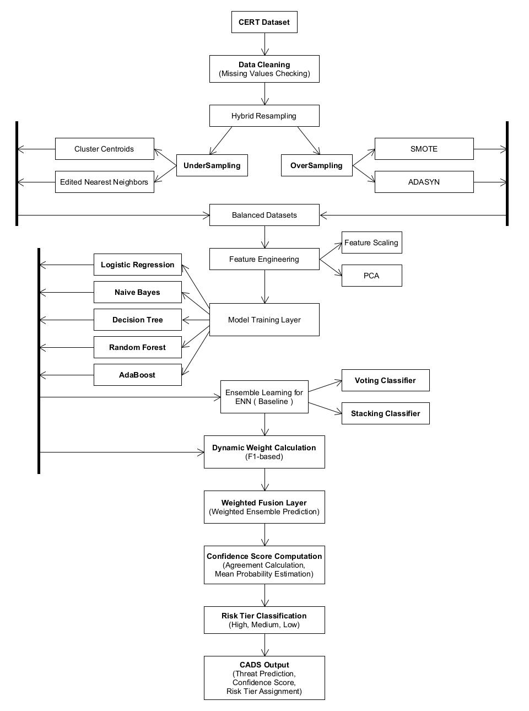
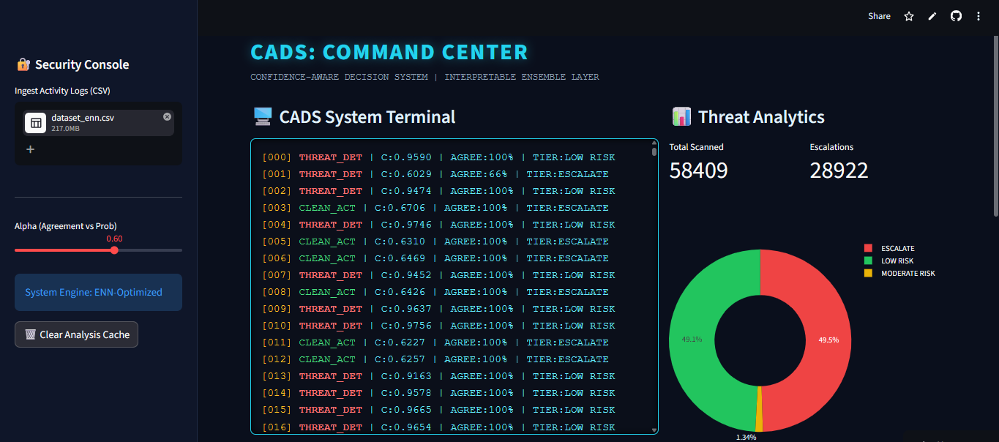

# Confidence-Aware Decision System (CADS)

## Overview

The Confidence-Aware Decision System (CADS) is a machine learning framework developed for insider threat detection using the CERT Insider Threat Dataset. Unlike traditional machine learning models that produce only binary predictions, CADS introduces a confidence-aware decision layer that estimates prediction confidence and assigns risk tiers to support security analysts during threat investigation.

The framework integrates ensemble learning, confidence estimation, and a Streamlit-based Analyst Command Center to provide interpretable and actionable insights for insider threat detection.

---

## Features

- Insider threat detection using machine learning
- Confidence-aware prediction framework
- Ensemble learning using Decision Tree, Random Forest, and AdaBoost
- Hybrid resampling for class imbalance handling
- Confidence score computation
- Risk tier classification (Low Risk, Moderate Risk, Escalate)
- Streamlit-based Analyst Command Center
- Threat analytics and visualization
- CSV report generation for forensic analysis

---

## Technology Stack

### Programming Language
- Python

### Machine Learning
- Scikit-learn
- Pandas
- NumPy
- Imbalanced-learn

### Visualization
- Plotly
- Matplotlib

### Deployment
- Streamlit

---

## Dataset

The project uses the **CERT Insider Threat Dataset v5.2**.

### Dataset Characteristics

- 693,649 records
- 830 features
- Highly imbalanced binary classification dataset

To address class imbalance, the following sampling techniques were evaluated:

- SMOTE
- ADASYN
- Cluster Centroids
- Edited Nearest Neighbors (ENN)

---

## Methodology

The proposed framework follows the workflow below:

1. Data preprocessing
2. Hybrid resampling
3. Feature engineering
4. Feature scaling
5. Principal Component Analysis (PCA)
6. Machine learning model training
7. Ensemble learning
8. Confidence score computation
9. Risk tier assignment
10. Streamlit dashboard deployment

---

## Models Used

- Logistic Regression
- Naive Bayes
- Decision Tree
- Random Forest
- AdaBoost
- Voting Classifier
- Stacking Classifier

The final CADS framework combines the outputs of the Decision Tree, Random Forest, and AdaBoost classifiers through a weighted decision-level fusion approach.

---

## Confidence-Aware Decision Layer

CADS computes a confidence score by combining:

- Classifier agreement
- Mean prediction probability

Based on the computed confidence score, each prediction is assigned to one of the following risk categories:

- Low Risk
- Moderate Risk
- Escalate

This enables security analysts to prioritize alerts and focus on predictions requiring immediate investigation.

---

## Results

The proposed CADS framework achieved:

- Accuracy: **99.60%**
- High Precision
- High Recall
- High F1-Score
- Confidence estimation for every prediction
- Risk-tier assignment for analyst decision support

---

## Project Structure

```text
CADS/
│
├── app.py
├── models/
├── dataset/
├── notebooks/
├── requirements.txt
├── screenshots/
└── README.md
```

> Modify the folder structure if your repository is organized differently.

---

## Installation

### Clone the repository

```bash
git clone https://github.com/<your-github-username>/CADS.git
```

### Navigate to the project directory

```bash
cd CADS
```

### Install dependencies

```bash
pip install -r requirements.txt
```

### Run the application

```bash
streamlit run app.py
```

---

## Screenshots

### Workflow diagram



### CADS Command Center with Threat Analytics




## Future Improvements

- Real-time insider threat detection
- Explainable AI (XAI) integration
- Alternative confidence weighting strategies
- Cloud deployment
- Evaluation on additional insider threat datasets

---

## Research Publication

**CADS: A Confidence-Aware Decision System for Insider Threat Detection and Response**

---

## What I Learned

Through this project, I gained practical experience in:

- Data preprocessing and feature engineering
- Handling highly imbalanced datasets
- Ensemble machine learning
- Confidence-aware decision support
- Risk-based classification
- Streamlit application development
- Data visualization
- Research methodology and technical paper writing

---

## Author

Aadhithya Pattabiraman
> This repository contains the files of "Confidence-Aware Decision System (CADS)" which was developed as a team and as part of our academic research.
